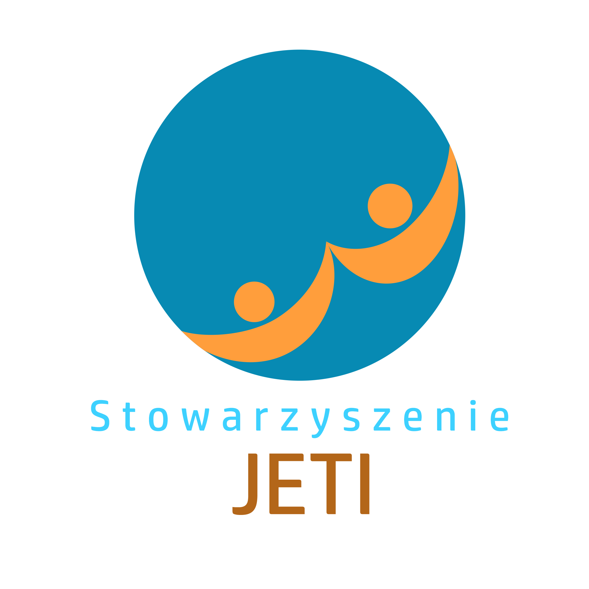
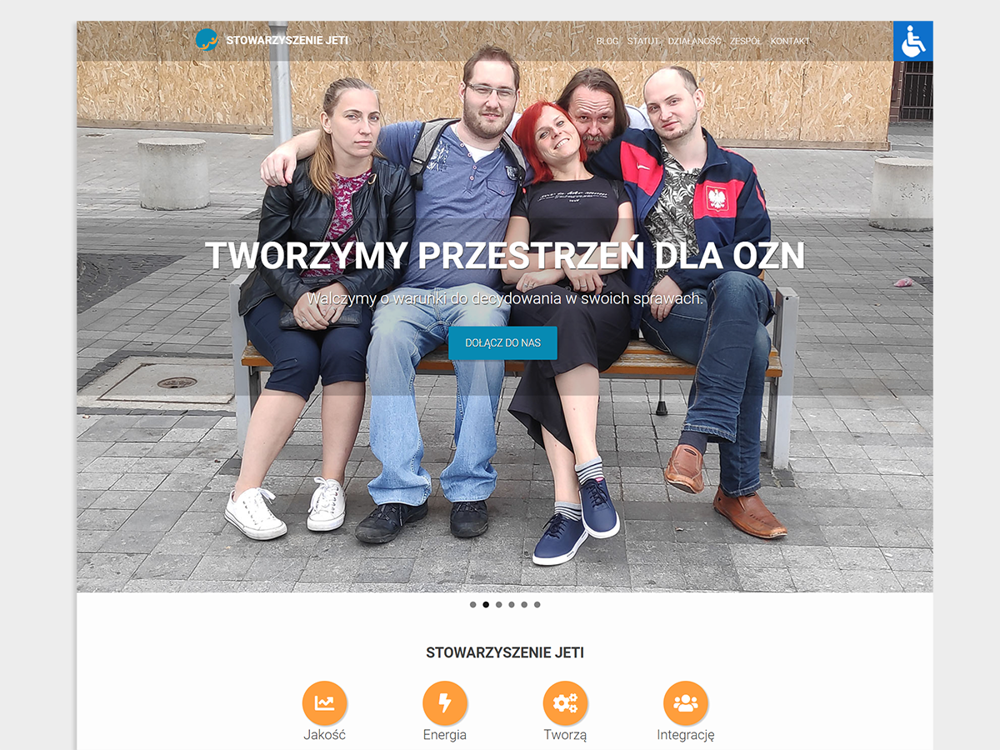

# materialwp-jeti



* Page dedicate for non-profit organisation: [Stowarzyszenie JETI](https://jeti.org.pl/). Base of page is Wordpress theme [MaterialWP](https://materialwp.com/).

 * README for base theme MaterialWP -> [here](./README_MATERIALWP.md)

## 🟤 Screenshots



## 🟤 Getting Started

1. Upload the theme to your WordPress directory in *wp-content/themes/*

2. Unpack archive [upload.7z](https://drive.google.com/file/d/1gwn-wYGwYksCyl4oVIw1knFhbmFKcUIr/view?usp=share_link) to *wp-content/*

    * leave the necessary files, delete the rest

        ```
        ├── headers
        │   ├── header_activity.jpg
        │   ├── header_contact.jpg
        │   ├── header_status.jpg
        │   └── header_team.jpg
        ├── landing-page
        │   ├── FOTO-6-1-1-500x260.jpg
        │   └── jeti_logo.png
        ├── logo-accessibility.jpg
        ├── logo_nav.png
        ├── slides
        │   ├── slide_n1.jpg
        │   ├── slide_n2.jpg
        │   ├── slide_n3.jpg
        │   ├── slide_n4.jpg
        │   ├── slide_n5.jpg
        │   └── slide_n6.jpg
        └── team
            ├── ava_10.png
            ├── ava_11.png
            ├── ava_1.png
            ├── ava_2.png
            ├── ava_3.png
            ├── ava_4.png
            ├── ava_5.png
            ├── ava_6.png
            ├── ava_7.png
            └── ava_9.png
        ```
## 🟤 Changelog 
* **1.1** Add js animation on landing page **[preview]** 🟢
* **1.0** First full version of page.

## 🟤 Author 

* **Kamil Cecherz** is the author of the theme modifications and all added resources.
* Website of the project author: [cecherz.pl](https://cecherz.pl/)

<hr />
<p style="text-align:center;">🔴🟠🟡🟢🔵🟣🟤⚫⚪🔘🛑⭕</p>
